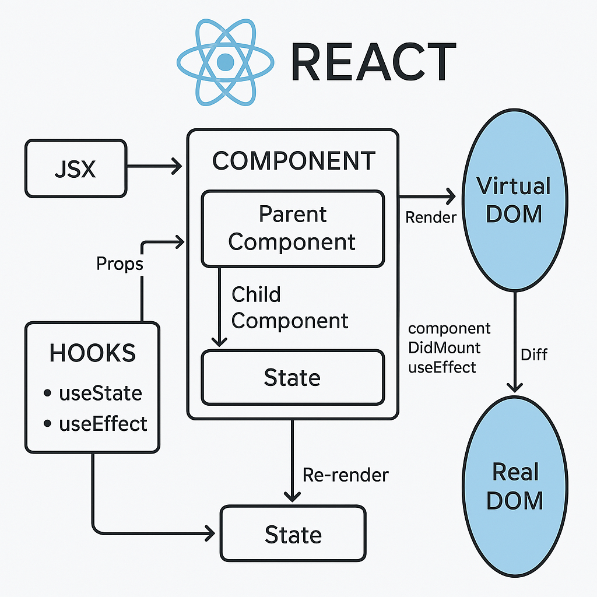

# React

React is a **JavaScript** library for building user interfaces, primarily for web applications. It was developed by Facebook and is widely used for creating dynamic and responsive UIs.

## Core Concepts

1. Components    

    React apps are built using components, which are reusable pieces of UI.
    Each component is a JavaScript function or class that returns JSX (a syntax extension that looks like HTML).

    ```js
    function Welcome(props) {
    return <h1>Hello, {props.name}</h1>;
    }
    ```

2. JSX (JavaScript XML)

    JSX allows you to write HTML-like code inside JavaScript.
    It makes the structure of UI components more readable and expressive.

3. State

    State is an object that holds data that can change over time.
    When state changes, React automatically re-renders the component.

    ```js
    const [count, setCount] = useState(0);
    ```

4. Props

    Props (short for "properties") are inputs passed to components.
    They allow components to be dynamic and reusable.

5. Virtual DOM

    React uses a virtual DOM to optimize rendering.
    When state or props change, React updates the virtual DOM first, compares it with the previous version, and then updates only the changed parts in the real DOM.

6. Hooks

    Hooks are functions that let you use state and other React features in functional components.
    Common hooks: `useState`, `useEffect`, `useContext`.

7. Unidirectional Data Flow

    Data flows from parent to child components via props.
    This makes the app easier to debug and maintain.

### How React Renders UI

1. You define components using JSX.
2. React builds a virtual DOM tree from these components.
3. When data changes (state or props), React:
    - Recalculates the virtual DOM.
    - Diffs it against the previous version.
    - Efficiently updates the real DOM.

